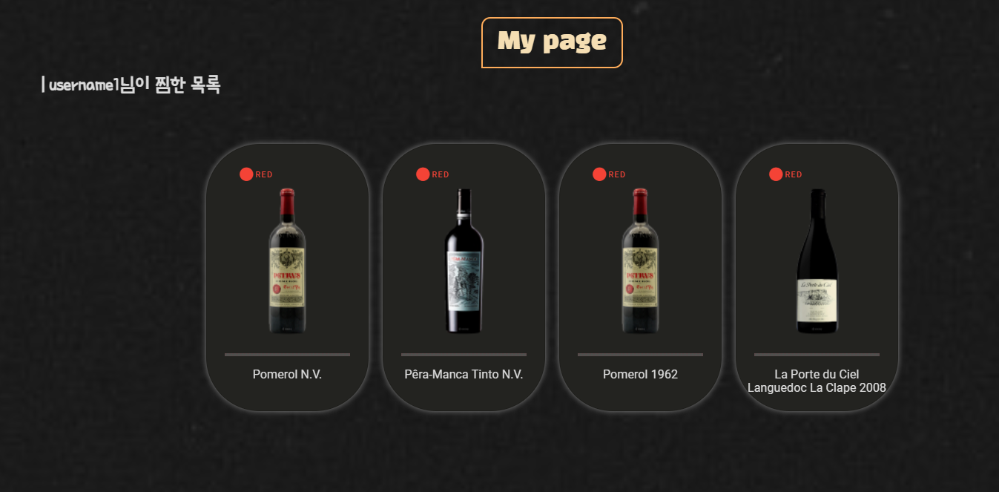
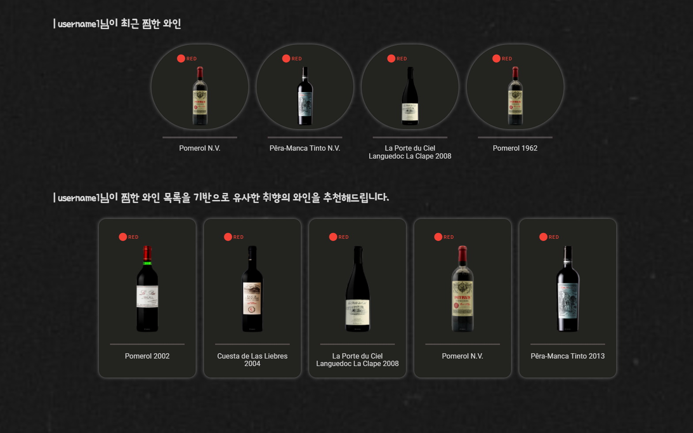
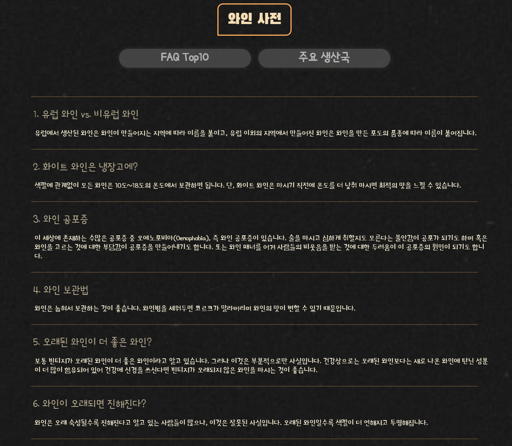
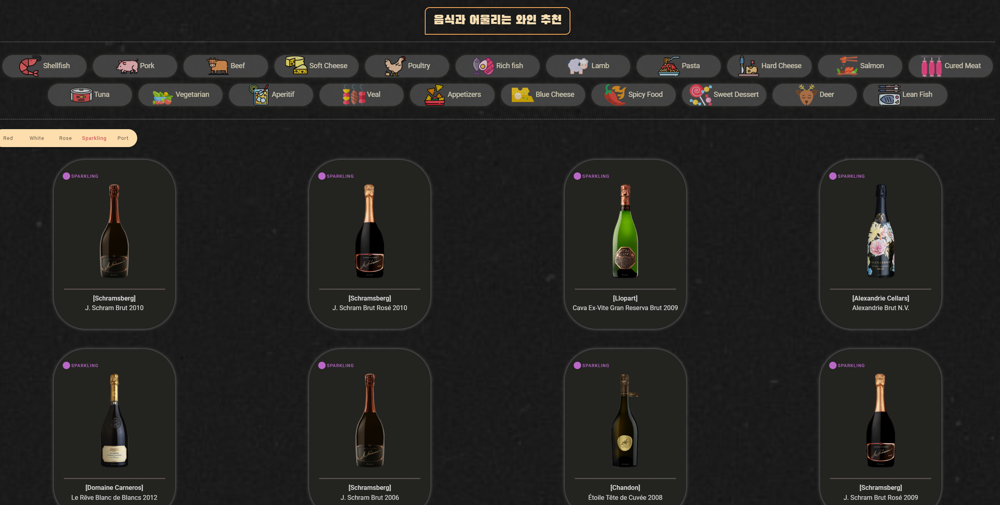
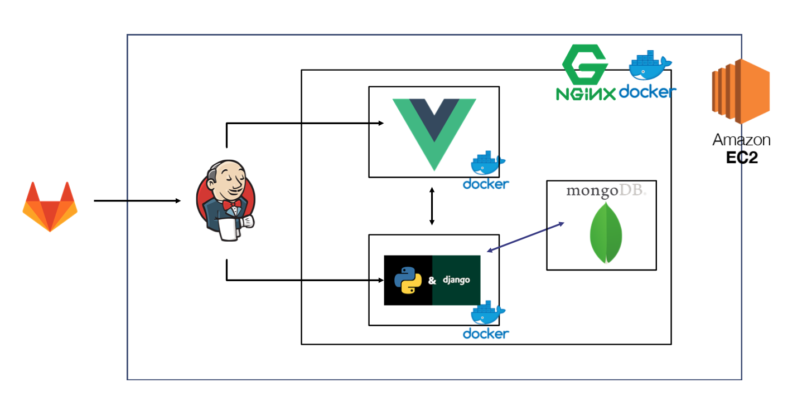
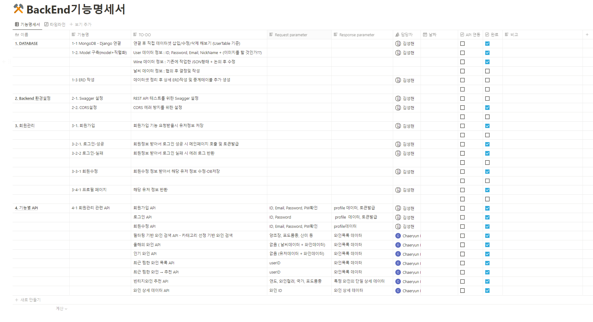
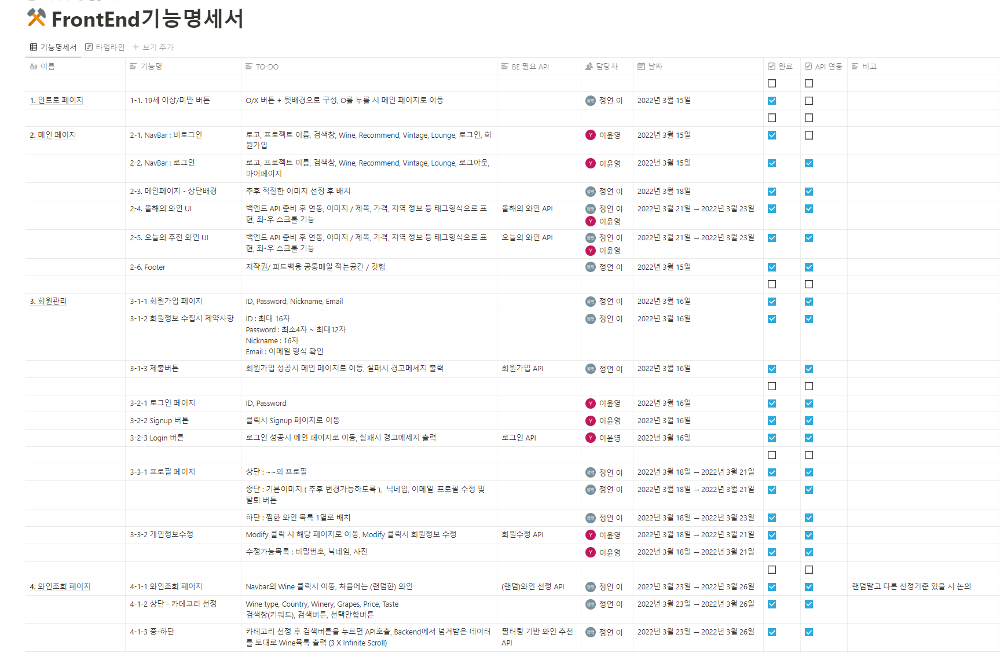

# 🍷와인어때 (빅데이터를 이용한 와인 추천 서비스)


## 💎와인어때 소개 및 시연 영상💎

### Service URL : http://j6c102.p.ssafy.io/

### [영상 링크]


## ✨Overview

#### 와인을 알고 싶지만 멀게만 느껴지는 당신! 당신에게 딱 맞는 와인을 추천해드리기 위해 "와인어때"서비스가 왔습니다!


## 👁 서비스 화면

- #### 시작화면


- #### 마이페이지 - 찜한와인목록(wishlist) 제공




- #### 와인 추천 기능 - 찜한 목록을 기반으로 최적와인 추천




- #### ABOUT WINE - 와인에 대한 다양한 읽을거리 제공




- #### 다양한 식재료 & 음식에 어울리는와인 추천기능 제공




- #### 지역 날씨 데이터를 이용하여 최근 3년간의 빈티지 추천 와인 제공


## ✨ 핵심 기능 및 특장점

- **주요 기능** 
  - **단일 와인 정보 - 국가, 포도품종, 가격, 향미, 산도 등 성분정보 제공**
  - **최근 선호와인을 바탕으로 유사한 와인을 새롭게 추천** 
  - **지역 날씨정보와 와인 정보를 결합하여 분석 후 빈티지 추천와인 제공** 
  - **와인 종류별로 많이 찾는 와인 및 평점이 높은 와인 제공** 
  - **단일 와인정보를 바탕으로 유사 와인 추천  특정 음식 및 식자재와 잘 어울리는 와인 카테고리별로 추천**  
  - **국가, 포도품종, 가격, 산미, 맛 등의 정보를 바탕으로 수요에 적합한 와인 추천**

### 🖥️ 개발 환경

------

🖱**Backend**

- **Django REST Framework 3.13.1 & Django 3.2.9**
- **pandas library 1.4.1**
- **Python 3.9.6**
- **MongoDB**
- **AWS EC2**

**🖱Frontend**

- **Visual Studio Code**
- **Vue 2.6.11**
- **Vuetify 2.6.0**
- **Vuex 3.4.0**

**🖱CI/CD**

- **aws ec2**

- **docker**

- **nginx**

- **jenkins**

  

## 🚀 서비스 아키텍쳐



## 🎨 협업 툴

- GIT

  - GIT Flow

  - ```bash
    Code Convention
    
    FE/DOCS red.json
    FEAT : 새로운 기능의 추가
    FIX: 버그 수정
    DOCS: 문서 수정
    STYLE: 스타일 관련 기능(코드 포맷팅, 세미콜론 누락, 코드 자체의 변경이 없는 경우)
    REFACTOR: 코드 리펙토링
    TEST: 테스트 코트, 리펙토링 테스트 코드 추가
    CHORE: 빌드 업무 수정, 패키지 매니저 수정(ex .gitignore 수정 같은 경우)
    ```

- Jira : TodoList 관리 및 StoryPoint 관리

- Notion : 기능명세서 및 일정관리

- Mattermost : 공지사항 및 커뮤니케이션 
- Gather Town : 공통 작업공간 및 사무실


## 🎮 기능명세서

- BackEnd



- FrontEnd




